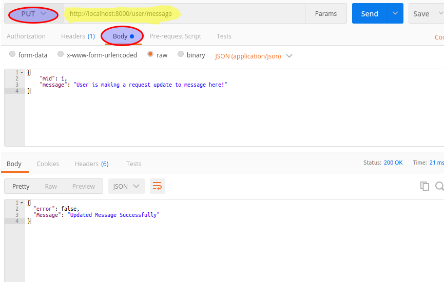

## NodeRestfulAPI
- Create your Database locally
Download and Install Node JS and MySQL Software.
Create the Database using the sample SQL scripts provided in `dbsetup.sql` file.


- Clone the Project
Open a terminal and run the following commands.
```
$ git clone https://github.com/Gmanweb/NodeRestfulAPI.git

$ cd NodeRestfulAPI

$ npm install
```
- Start node server
Open another terminal in the same folder 'NodeRestfulAPI' and run the folling command
```
node server.js
```
> which should return:
```
Connected & Listen to port 8000
```
Open your browser
```
http://localhost:8000/users
```
##### GET users
> `http://localhost:8000/users`
```
{
	error: false,
	Users: [ 
	{
		uid: 1,
		username: "gman",
		password: "password",
		email: "gm@n.ie"
	},{
		uid: 2,
		username: "web",
		password: "password",
		email: "web@n.ie"
	}]
}
```
##### GET user `2`
> `http://localhost:8000/user/2`
```
{
	error: false,
	Users: [ 
	{
		uid: 2,
		username: "web",
		password: "password",
		email: "web@n.ie"
	}]
}
```
##### GET messages for user `1`
>`http://localhost:8000/user/messages/1`
```
{
	error: false,
	Messages: [
	{
		mid: 1,
		message: "User is making a request"
	},
	{
		mid: 2,
		message: "Check out the Restful service here"
	},
	{
		mid: 3,
		message: "This REST is the real deal"
	}]
}
```
Use a rest client like [POSTMAN](https://chrome.google.com/webstore/detail/postman/fhbjgbiflinjbdggehcddcbncdddomop?hl=en) REST  Extention to make the PUT request
##### PUT update message for user `1`
>`http://localhost:8000/user/message`

**Request:**
```
{
	"mid": 1,
	"message": "User is making a request update to message here!"
}
```
**Response:**
```
{
  "error": false,
  "Message": "Updated Message Successfully"
}
```

Screenshot:




